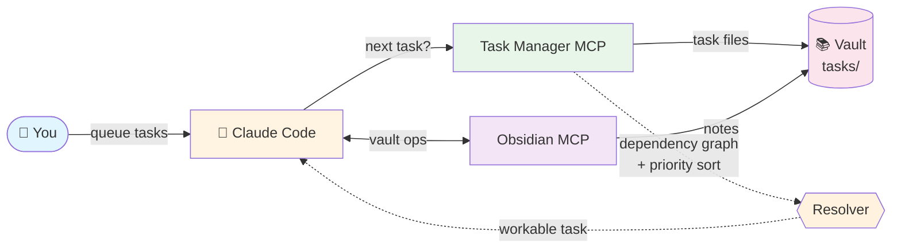
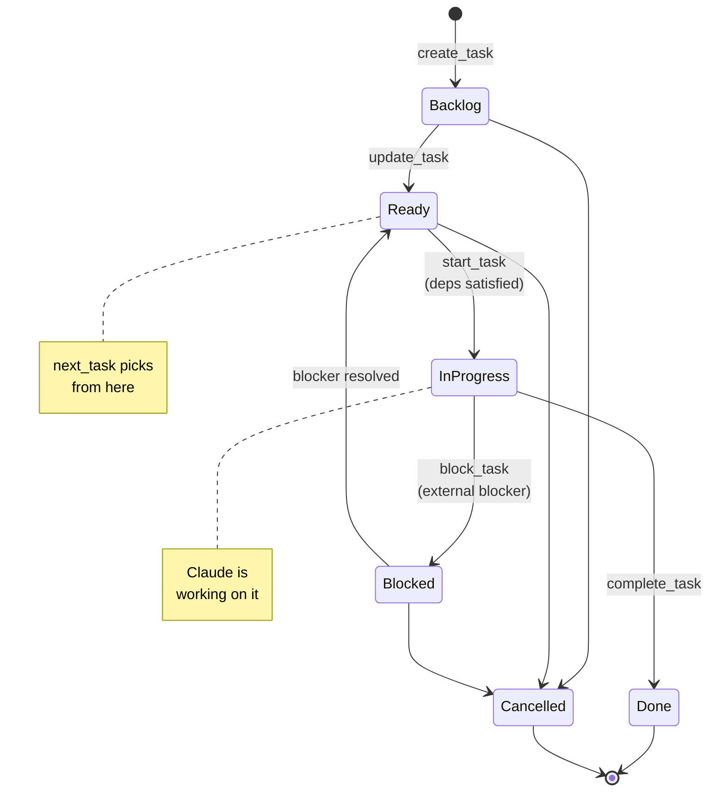
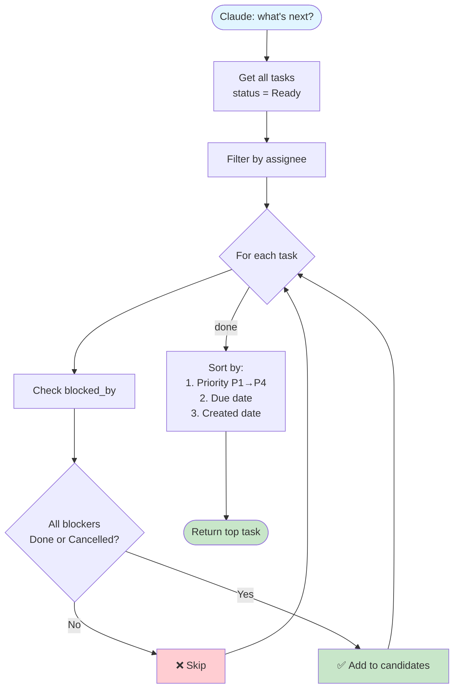

# Task Manager MCP

A [Model Context Protocol (MCP)](https://modelcontextprotocol.io/) server for task management with **dependency resolution**. Stores tasks as markdown files in an Obsidian vault, lets you queue work, assign tasks to Claude, and have Claude pick up the next workable task automatically.

## Architecture



## Status State Machine



## Dependency Resolution



## Example Dependency Tree

```
T-042: Implement rate limiting (Ready, P2)
├── [✓] T-038: Refactor auth middleware (Done)
└── [ ] T-040: Upgrade Redis (In Progress)
    └── [✓] T-039: Backup current Redis data (Done)
```

T-042 is blocked because T-040 is still in progress. `next_task` will skip it and return T-040 first.

## Why

Task lists alone aren't enough — you need to know **what to work on first**. This MCP gives you:

- **Dependency resolution** — `next_task` returns tasks whose blockers are all Done
- **Priority + due date sorting** — P1s first, then by due date
- **Cycle detection** — prevents impossible task graphs
- **Status workflow** — Backlog → Ready → In Progress → Done (with Blocked / Cancelled escapes)
- **Claude assignee** — `assignee: claude` lets Claude know which tasks to pick up
- **Auto-unblock notification** — when you complete a task, Claude tells you what's now ready

## Features

| Tool | Purpose |
|---|---|
| `create_task` | Create task with auto-incrementing ID |
| `list_tasks` | Filter by status, assignee, priority, project |
| `get_task` | Read full task details + body |
| `update_task` | Change any task field |
| `add_blocker` | Add a dependency (with cycle check) |
| `start_task` | Mark In Progress (verifies deps satisfied) |
| `complete_task` | Mark Done + announce what's unblocked |
| `block_task` | Mark Blocked with reason (external blockers) |
| `next_task` | Get next workable task (deps satisfied, sorted by priority) |
| `my_tasks` | Quick view: overdue, due today, in progress |
| `task_tree` | Show dependency tree as ASCII |
| `blocked_tasks` | List Ready tasks waiting on dependencies |
| `validate_dependencies` | Check for cycles + missing deps |

## Task Format

Each task is a markdown file in `tasks/` folder of the vault:

```yaml
---
type: task
id: T-042
title: Implement rate limiting
status: Ready          # Backlog, Ready, In Progress, Done, Blocked, Cancelled
priority: P2           # P1, P2, P3, P4
assignee: claude       # me, claude
project: "[[API Migration]]"
area: Backend
created: 2026-04-09
due: 2026-04-15
blocked_by: [T-038, T-040]
tags: [backend, performance]
---

## What to do
Add token-bucket rate limiting to the v3 API endpoints.

## Acceptance criteria
- [ ] 100 req/min per client default
- [ ] Rate limit headers returned
- [ ] Tests cover bucket exhaustion
```

## Installation

### Docker (recommended)

```bash
docker pull ghcr.io/punparin/task-manager-mcp:latest
```

### Local virtualenv

```bash
git clone https://github.com/punparin/task-manager-mcp.git
cd task-manager-mcp
python3 -m venv .venv
.venv/bin/pip install -e .
```

## Register with Claude Code

### Docker

```bash
claude mcp add \
  -s user \
  task-manager \
  -- docker run -i --rm -v /path/to/your/vault:/vault ghcr.io/punparin/task-manager-mcp:latest
```

### Local

```bash
claude mcp add \
  -e OBSIDIAN_VAULT_PATH=/path/to/your/vault \
  -s user \
  task-manager \
  -- /path/to/task-manager-mcp/.venv/bin/python -m task_manager_mcp
```

## Workflow Example

**You queue work:**
```
You: create task "Fix auth bug" P2 assignee:claude blocked_by:T-038
Claude: Created T-042. Won't appear in next_task until T-038 is Done.
```

**Claude picks up work:**
```
You: what's next?
Claude: [next_task]
        → T-038: Refactor auth middleware (P2, no blockers)
        Want me to start? T-042 is waiting on this.
You: yes
Claude: [start_task T-038, works, completes]
        Done. Unblocked: T-042 (Fix auth bug)
```

**Daily review:**
```
You: my tasks today
Claude: [my_tasks]
        Overdue: T-035 (Update docs)
        Due today: T-040 (Deploy v3)
        In progress: T-038 (Refactor middleware)
```

## Architecture

- `task_manager_mcp/server.py` — FastMCP server, 13 tools
- `task_manager_mcp/tasks.py` — Task dataclass, file I/O
- `task_manager_mcp/deps.py` — Dependency resolver, cycle detection, next_task algorithm

Tasks are stored in the same vault as your Obsidian notes — they coexist with [obsidian-mcp](https://github.com/punparin/obsidian-mcp) for full vault + task workflow.

## Development

```bash
pip install -e ".[dev]"
pytest tests/ -v
```
