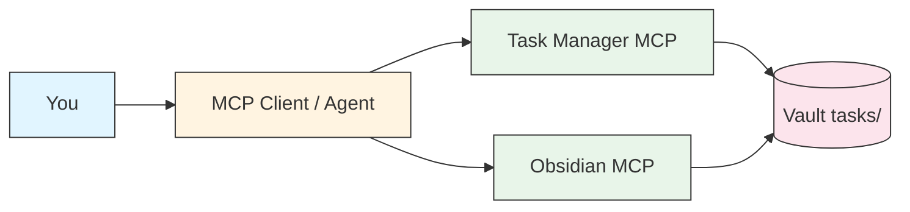
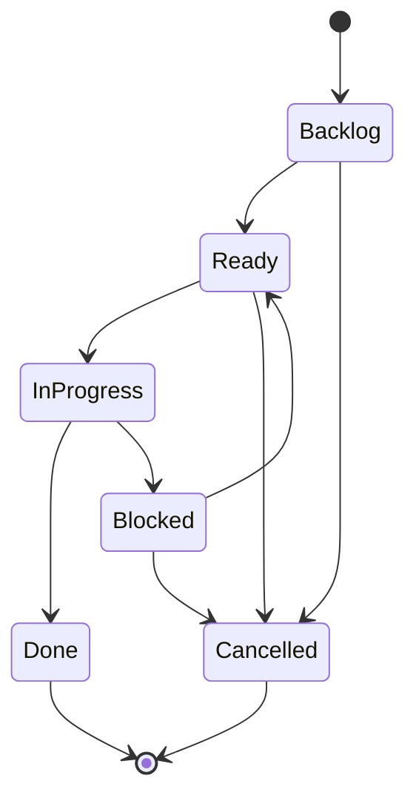
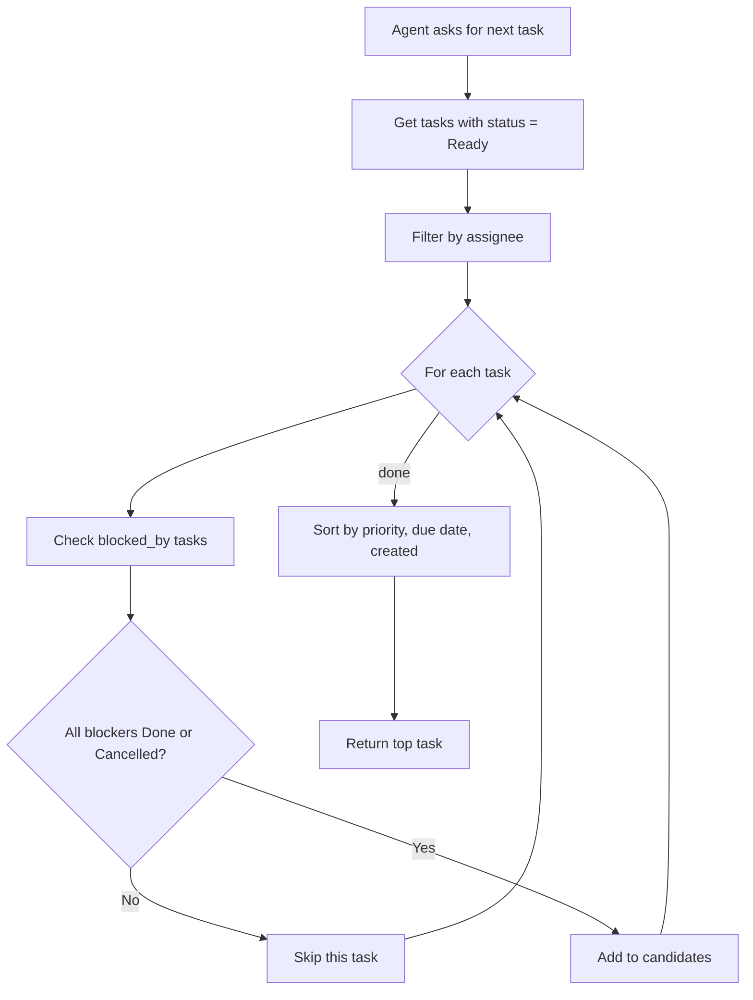

# Task Manager MCP

A [Model Context Protocol (MCP)](https://modelcontextprotocol.io/) server for task management with **dependency resolution**. Stores tasks as markdown files in an Obsidian vault, lets you queue work, assign tasks to your agent, and have any MCP-capable agent (Claude Code, Cursor, Cline, Continue, Goose, Windsurf, …) pick up the next workable task automatically.

## Install via your agent (easiest)

Open your MCP-capable agent (Claude Code, Cursor, Cline, …), paste:

> Read this and help me install it: <https://github.com/punparin/task-manager-mcp/blob/main/INSTALLATION.md>

The agent will walk you through it — picking Docker vs Python, vault
path, tasks folder, actor list, scope — and ask before assuming
anything. See [`INSTALLATION.md`](./INSTALLATION.md) for the full guide.

Prefer to do it by hand? Keep reading.

## Quickstart

```bash
# 1. Pull the image
docker pull ghcr.io/punparin/task-manager-mcp:latest

# 2. Register with your MCP client (Claude Code shown — see "Register
#    with Your MCP Client" below for other clients).
claude mcp add -s user task-manager -- \
  docker run -i --rm \
    -v /path/to/your/vault:/vault \
    ghcr.io/punparin/task-manager-mcp:latest
```

Then in your agent, try:

```
create task "First demo task" P2 assignee:agent
next_task
```

The first call writes `T-001.md` into `<vault>/tasks/`; the second
returns it because nothing's blocking it. Mark it Done with
`complete_task T-001` and the agent will tell you what's now
unblocked.

Want a Kanban board for the same tasks? Run the
[Explorer](#explorer-web-ui) sidecar (`docker run -p 8765:8765 …
task-manager-mcp-explorer`) and open `http://localhost:8765`.

## Architecture



## Status State Machine



`next_task` picks from `Ready` only. `start_task` moves to `InProgress`. `complete_task` moves to `Done` and announces unblocked tasks.

## Dependency Resolution



## Example Dependency Tree

```
T-042: Implement rate limiting (Ready, P2)
├── [x] T-038: Refactor auth middleware (Done)
└── [ ] T-040: Upgrade Redis (In Progress)
    └── [x] T-039: Backup current Redis data (Done)
```

T-042 is blocked because T-040 is still in progress. `next_task` will skip it and return T-040 first.

## Why

Task lists alone aren't enough — you need to know **what to work on first**. This MCP gives you:

- **Dependency resolution** — `next_task` returns tasks whose blockers are all Done
- **Priority + due date sorting** — P1s first, then by due date
- **Cycle detection** — prevents impossible task graphs
- **Status workflow** — Backlog → Ready → In Progress → Done (with Blocked / Cancelled escapes)
- **Agent assignee** — `assignee: claude` is the convention for tasks the agent should pick up (works with any MCP client; the literal value `claude` is just the historical name baked into the schema)
- **Auto-unblock notification** — when you complete a task, the agent tells you what's now ready

## Features

| Tool | Purpose |
|---|---|
| `create_task` | Create task with auto-incrementing ID |
| `list_tasks` | Filter by status, assignee, priority, project |
| `get_task` | Read full task details + body |
| `update_task` | Change any task field |
| `tick_item` | Check/uncheck a checklist item in the body (1-based index) |
| `add_comment` | Append a dated note under the task body's `## Comments` section |
| `list_comments` | List all comments on a task |
| `add_blocker` | Add a dependency (with cycle check) |
| `start_task` | Mark In Progress (verifies deps satisfied) |
| `complete_task` | Mark Done + announce what's unblocked |
| `block_task` | Mark Blocked with reason (external blockers) |
| `next_task` | Get next workable task (deps satisfied, sorted by priority) |
| `my_tasks` | Quick view: overdue, due today, in progress |
| `task_tree` | Show dependency tree as ASCII |
| `blocked_tasks` | List Ready tasks waiting on dependencies |
| `validate_dependencies` | Check for cycles + missing deps |

## Task Format

Each task is a markdown file in the tasks folder of the vault. The
folder defaults to `tasks/` but is configurable — set
`TASK_MANAGER_TASKS_FOLDER` to e.g. `inbox/tasks` or `work/queue` if
your vault layout already has somewhere tasks belong. The path is
resolved relative to the vault root and may be nested; `..` escapes
that resolve outside the vault are rejected at startup.

```yaml
---
type: task
id: T-042
title: Implement rate limiting
status: Ready          # Backlog, Ready, In Progress, Done, Blocked, Cancelled
priority: P2           # P1, P2, P3, P4
assignee: agent        # me, agent (legacy 'claude' still accepted as a synonym for 'agent')
project: "[[API Migration]]"
area: Backend
created: 2026-04-09
due: 2026-04-15
blocked_by: [T-038, T-040]
tags: [backend, performance]
---

## What to do
Add token-bucket rate limiting to the v3 API endpoints.

## Acceptance criteria
- [ ] 100 req/min per client default
- [ ] Rate limit headers returned
- [ ] Tests cover bucket exhaustion
```

## Comments

Use `add_comment(task_id, text, author)` to leave a dated note under
the task body's `## Comments` section — references found, decisions
made, follow-ups noticed. Comments are plain markdown bullets so they
render natively in Obsidian and can be edited there directly:

```markdown
## Comments

- **2026-05-07 agent**: looked at auth middleware, line 142 is the bug
- **2026-05-08 me**: also need OAuth coverage, talked to alice
```

`author` is validated against the same actor list as `assignee:` (so
`me`, `agent`, or any custom actors from `.task-manager/config.yml`),
and defaults to `agent`. The section is created on first comment.
`get_task` returns parsed comments under a `comments` array, and
`list_tasks` / `next_task` show a `comment_count` so triage can see
which tasks have notes without expanding them.

## Checklist Progress

Any `- [ ]` / `- [x]` items in a task body are parsed as substeps. `get_task`, `list_tasks`, `next_task`, and `my_tasks` include a `progress: {done, total, pct}` rollup whenever the body has at least one checkbox — so you can see "T-042 (3/5, 60%)" without expanding the task.

Use `tick_item(task_id, index, checked=True)` to flip a single box without rewriting the body. Index is 1-based, counting all checkboxes in document order (nested items included). Code fences are skipped, so `[ ]` inside ```` ``` ```` blocks won't be miscounted.

Progress is **derived on read** — never persisted to frontmatter — so editing the body in Obsidian and calling `tick_item` from your agent can't drift apart. Completion is still explicit: `complete_task` does not auto-fire when all boxes are checked, since marking Done has side effects (timestamp, downstream unblock).

## Installation

### Docker (recommended)

```bash
docker pull ghcr.io/punparin/task-manager-mcp:latest
```

### Local virtualenv

```bash
git clone https://github.com/punparin/task-manager-mcp.git
cd task-manager-mcp
python3 -m venv .venv
.venv/bin/pip install -e .
```

## Register with Your MCP Client

The server speaks stdio MCP, so it works with any MCP-capable client.
Concrete examples below use Claude Code's `claude mcp add` CLI; for
[Cursor](https://docs.cursor.com/), [Cline](https://cline.bot/),
[Continue](https://www.continue.dev/), [Goose](https://block.github.io/goose/),
[Windsurf](https://codeium.com/windsurf), or any other MCP host, plug
the same `docker run …` or `python -m task_manager_mcp` command into
your client's MCP server config.

### Docker (Claude Code example)

```bash
claude mcp add \
  -s user \
  task-manager \
  -- docker run -i --rm -v /path/to/your/vault:/vault ghcr.io/punparin/task-manager-mcp:latest
```

### Local (Claude Code example)

```bash
claude mcp add \
  -e OBSIDIAN_VAULT_PATH=/path/to/your/vault \
  -s user \
  task-manager \
  -- /path/to/task-manager-mcp/.venv/bin/python -m task_manager_mcp
```

### Custom tasks folder

If your vault already has a different home for task files, point
`TASK_MANAGER_TASKS_FOLDER` at it (relative to the vault root):

```bash
# Docker
docker run -i --rm \
  -v /path/to/your/vault:/vault \
  -e TASK_MANAGER_TASKS_FOLDER=inbox/tasks \
  ghcr.io/punparin/task-manager-mcp:latest

# Local
TASK_MANAGER_TASKS_FOLDER=work/queue \
OBSIDIAN_VAULT_PATH=/path/to/your/vault \
  /path/to/task-manager-mcp/.venv/bin/python -m task_manager_mcp
```

The folder is created on first run if it doesn't exist. Hit
`/api/health` on the Explorer to confirm which path resolved.

### Custom actors

Out of the box, tasks can be assigned to `me` (the human) or `agent`
(an MCP agent). To onboard a team — multiple humans, multiple AI
agents, or both — drop a config file at `<vault>/.task-manager/config.yml`:

```yaml
actors:
  - me
  - agent
  - alice
  - bob
  - cursor
```

The list replaces the defaults — if your team works strictly in named
handles, you can omit `me` and `agent` entirely. The config lives in
the vault, so syncing the vault syncs the actor list across the team.
Validation runs only on writes; existing task files keep loading even
if you later remove an actor (they just can't be re-saved with that
assignee). Hit `/api/health` on the Explorer to see the resolved list.

The legacy `claude` value is always accepted as an alias for `agent`,
so vaults written before agents were renamed still round-trip.

## Workflow Example

The dialogue below uses a generic "Agent:" label — the exact prompt
shape is whatever your MCP client uses (slash commands, free-form
chat, etc.).

**You queue work:**
```
You:   create task "Fix auth bug" P2 assignee:claude blocked_by:T-038
Agent: Created T-042. Won't appear in next_task until T-038 is Done.
```

**Agent picks up work:**
```
You:   what's next?
Agent: [next_task]
       → T-038: Refactor auth middleware (P2, no blockers)
       Want me to start? T-042 is waiting on this.
You:   yes
Agent: [start_task T-038, works, completes]
       Done. Unblocked: T-042 (Fix auth bug)
```

**Daily review:**
```
You:   my tasks today
Agent: [my_tasks]
       Overdue: T-035 (Update docs)
       Due today: T-040 (Deploy v3)
       In progress: T-038 (Refactor middleware)
```

## Explorer (web UI)

A FastAPI sidecar serves a Kanban board over HTTP — useful when you mostly
SSH to a Pi and want a real GUI for triage instead of slash commands. Same
vault, same `tasks/` folder, same frontmatter — Explorer just renders it.

### Features

- Drag-and-drop between lanes (Backlog → Ready → In Progress → Blocked → Done → Cancelled)
- Status changes write directly to task frontmatter; the MCP and the UI agree on one source of truth
- Dependency-aware: dragging a Ready-but-blocked card to **In Progress** is rejected with `409` and the unfinished blockers listed
- Completing a task auto-stamps `completed: <today>` and surfaces newly unblocked tasks as a toast
- `next_task` is highlighted with a green border so you always see what's up next
- Checklist progress on cards and in the side panel — tick boxes inline, written straight to the task body
- Dep graph view (Cytoscape.js) — click a node to open the side panel
- Filters: assignee, priority, project, area, hide done/cancelled
- Universal search (id / title / project / area / tag) with a live result count
- Auto-refresh that preserves scroll position and selection so triage doesn't jump around
- Package version shown in the header for quick "what am I running?" checks

### Run

```bash
pip install -e ".[explorer]"
OBSIDIAN_VAULT_PATH=/path/to/vault \
  python -m task_manager_mcp.explorer --host 0.0.0.0 --port 8765
```

Then open `http://<host>:8765`. From a laptop/phone, expose via SSH tunnel
or Tailscale.

### Docker

```bash
docker pull ghcr.io/punparin/task-manager-mcp-explorer:latest
docker run -p 8765:8765 -v /path/to/vault:/vault ghcr.io/punparin/task-manager-mcp-explorer:latest
```

### Endpoints

| Method | Path | Purpose |
|---|---|---|
| `GET` | `/api/health` | Vault path, task count, valid enums |
| `GET` | `/api/tasks` | List with filters: `?status=&assignee=&priority=&project=&area=`. Returns `next_task_id` |
| `GET` | `/api/tasks/{id}` | Full detail: body, dep tree, computed `is_unblocked`, `unfinished_blockers`, `dep_count` |
| `PATCH` | `/api/tasks/{id}/status` | Body `{status, completion_notes?}`. Validates deps when target is `In Progress`. Returns `{task, old_status, unblocked}` |
| `PATCH` | `/api/tasks/{id}/checklist/{index}` | Body `{checked}`. Flips the n-th checkbox in the body (1-based). Mirrors MCP `tick_item` |
| `PATCH` | `/api/tasks/{id}` | Update fields (title, priority, due, etc.) |
| `POST` | `/api/tasks` | Create task |
| `GET` | `/api/next?assignee=` | Same logic as MCP `next_task` |
| `GET` | `/api/blocked` | Ready tasks waiting on unfinished deps |
| `GET` | `/api/graph` | Cytoscape-shaped `{nodes, edges}` for the dep graph |

## Architecture

- `task_manager_mcp/server.py` — FastMCP server, 14 tools
- `task_manager_mcp/tasks.py` — Task dataclass, file I/O
- `task_manager_mcp/deps.py` — Dependency resolver, cycle detection, next_task algorithm
- `task_manager_mcp/explorer/` — FastAPI sidecar (web UI + REST)

Tasks are stored in the same vault as your Obsidian notes — they coexist with [obsidian-mcp](https://github.com/punparin/obsidian-mcp) for full vault + task workflow.

## Development

```bash
pip install -e ".[dev,explorer]"
pytest tests/ -v
ruff check .
```
