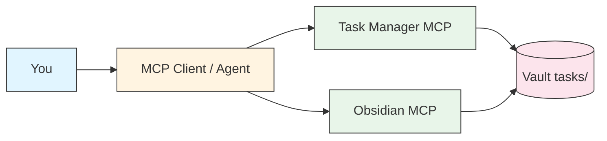
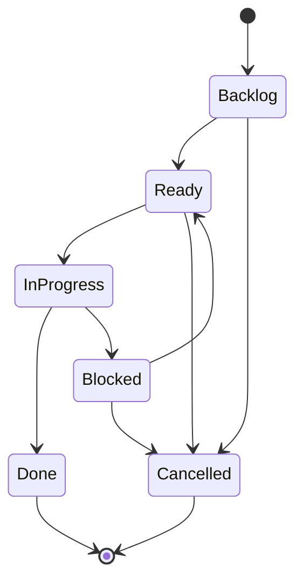
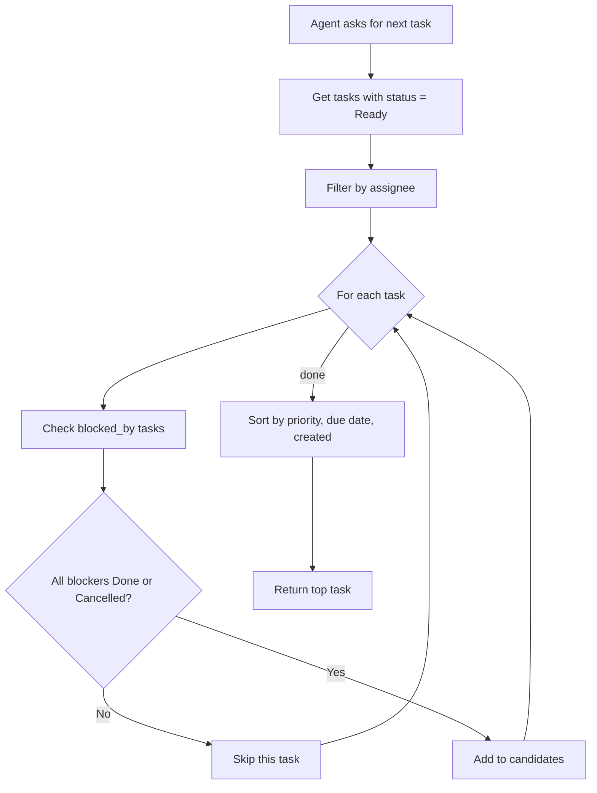

# Architecture

Task Manager MCP is a thin layer on top of plain markdown files in your
Obsidian vault. The MCP server reads/writes those files; the optional
Explorer sidecar renders them as a Kanban board over HTTP. They share
the vault as the single source of truth — there is no separate
database.



## Status state machine

Every task lives somewhere in this graph. `next_task` only picks from
`Ready`; everything else is either upstream (Backlog), in flight
(In Progress / Blocked), or terminal (Done / Cancelled).



`start_task` moves Ready → In Progress (and refuses if any blocker is
unfinished). `complete_task` moves In Progress → Done, announces which
Ready tasks were waiting on the one that just closed, and
auto-promotes Backlog dependents to Ready when their last blocker
clears (the dashed Backlog → Ready transition above). Every
transition is also written to the audit log — see
[`task-format.md`](./task-format.md#status-history).

## Dependency resolution

`next_task` is the heart of the system. Given the current vault state,
it returns the highest-priority Ready task whose blockers are all
done.



Cycle detection runs on every `create_task` / `update_task` /
`add_blocker` call, so the graph above is guaranteed acyclic at query
time.

## Example dependency tree

```
T-042: Implement rate limiting (Ready, P2)
├── [x] T-038: Refactor auth middleware (Done)
└── [ ] T-040: Upgrade Redis (In Progress)
    └── [x] T-039: Backup current Redis data (Done)
```

T-042 is blocked because T-040 is still in progress. `next_task` will
skip T-042 and return T-040 first.

## Modules

- `task_manager_mcp/server.py` — FastMCP server, tool definitions
- `task_manager_mcp/tasks.py` — `Task` dataclass, status/priority
  enums, file I/O, actor validation
- `task_manager_mcp/deps.py` — dependency resolver, cycle detection,
  `next_task` algorithm, tree rendering
- `task_manager_mcp/checklist.py` — body checklist parser
  (`- [ ]` / `- [x]`), progress rollup, `tick()` mutation. Progress is
  derived on read — never persisted in frontmatter — so the body is
  the single source of truth.
- `task_manager_mcp/comments.py` — dated comment thread under a
  `## Comments` section in the task body. Same body-is-truth pattern
  as the checklist.
- `task_manager_mcp/audit.py` — append-only status-change log at
  `<vault>/.task-manager/audit.jsonl`, plus `last_status_change`
  frontmatter mirroring. Powers `list_audit` and the Explorer's
  `/api/audit` endpoint.
- `task_manager_mcp/explorer/` — FastAPI sidecar serving a
  drag-and-drop Kanban UI over the same vault. See
  [`explorer.md`](./explorer.md).

Tasks coexist with regular notes in your vault — pair this with
[obsidian-mcp](https://github.com/punparin/obsidian-mcp) for full
vault + task workflow.
