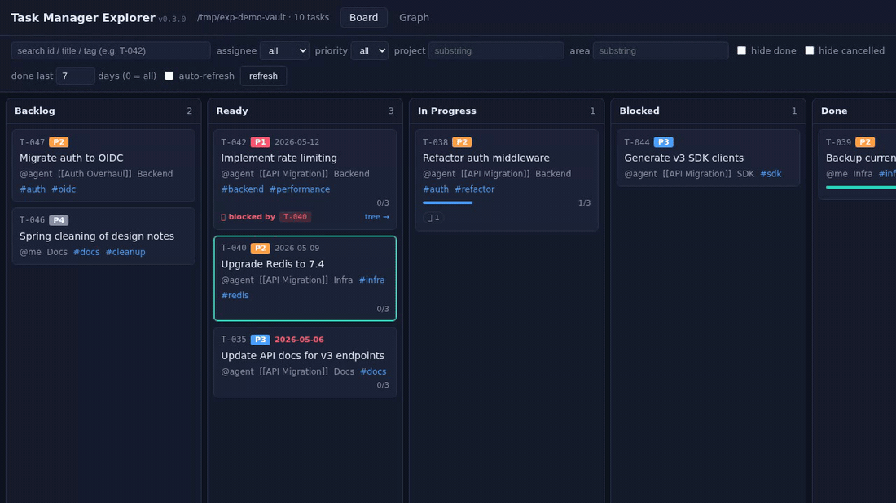

# Explorer (web UI)

A FastAPI sidecar that serves a Kanban board over HTTP — useful when
you mostly SSH to a Pi and want a real GUI for triage instead of
slash commands. Same vault, same `tasks/` folder, same frontmatter —
Explorer just renders it.



## Features

- Drag-and-drop between lanes (Backlog → Ready → In Progress →
  Blocked → Done → Cancelled)
- Status changes write directly to task frontmatter; the MCP and the
  UI agree on one source of truth
- Dependency-aware: dragging a Ready-but-blocked card to **In
  Progress** is rejected with `409` and the unfinished blockers
  listed
- Completing a task auto-stamps `completed: <today>` and surfaces
  newly unblocked tasks as a toast. The **Complete…** button reveals
  an inline form for completion notes that get written under
  `## Completion Notes`
- `next_task` is highlighted with a green border so you always see
  what's up next
- Checklist progress on cards and in the side panel — tick boxes
  inline, written straight to the task body
- Comment thread on every task — bubbles in the side panel, an
  inline "add comment" form (author picker driven by the configured
  actor list), and a `💬 N` chip on cards. Mirrors the MCP
  `add_comment` tool, so notes added in the UI are visible to the
  agent and vice versa
- Completion notes render as a dedicated callout above the body when
  the task is Done
- Dep graph view (Cytoscape.js) — click a node to open the side
  panel
- Filters: assignee, priority, project, area, hide done/cancelled
- Universal search (id / title / project / area / tag) with a live
  result count
- Auto-refresh that preserves scroll position and selection so
  triage doesn't jump around
- Package version shown in the header for quick "what am I running?"
  checks

## Run

### Local

```bash
pip install -e ".[explorer]"
OBSIDIAN_VAULT_PATH=/path/to/vault \
  python -m task_manager_mcp.explorer --host 0.0.0.0 --port 8765
```

Then open `http://<host>:8765`. From a laptop/phone, expose via SSH
tunnel or Tailscale.

### Docker

```bash
docker pull ghcr.io/punparin/task-manager-mcp-explorer:latest
docker run -p 8765:8765 -v /path/to/vault:/vault \
  ghcr.io/punparin/task-manager-mcp-explorer:latest
```

## Endpoints

| Method | Path | Purpose |
|---|---|---|
| `GET` | `/api/health` | Vault path, task count, valid enums |
| `GET` | `/api/tasks` | List with filters: `?status=&assignee=&priority=&project=&area=`. Returns `next_task_id` |
| `GET` | `/api/tasks/{id}` | Full detail: body, dep tree, parsed `comments`, extracted `completion_notes`, status `history` (from audit log), computed `is_unblocked`, `unfinished_blockers`, `dep_count` |
| `PATCH` | `/api/tasks/{id}/status` | Body `{status, completion_notes?}`. Validates deps when target is `In Progress`. Returns `{task, old_status, unblocked, promoted, cleared}` — `promoted` lists Backlog dependents auto-flipped to Ready when the change is to `Done` or `Cancelled`. On `Cancelled`, `cleared` lists dependents whose dead `blocked_by` reference to this task was stripped |
| `PATCH` | `/api/tasks/{id}/checklist/{index}` | Body `{checked}`. Flips the n-th checkbox in the body (1-based). Mirrors MCP `tick_item` |
| `POST` | `/api/tasks/{id}/comments` | Body `{text, author?}`. Appends a dated comment under `## Comments`. Mirrors MCP `add_comment` |
| `PATCH` | `/api/tasks/{id}` | Update fields (title, priority, due, etc.) |
| `POST` | `/api/tasks` | Create task |
| `GET` | `/api/next?assignee=` | Same logic as MCP `next_task` |
| `GET` | `/api/blocked` | Ready tasks waiting on unfinished deps |
| `GET` | `/api/audit` | Status-change audit log: `?since=YYYY-MM-DD&task_id=&limit=`. Newest first. Mirrors MCP `list_audit` |
| `GET` | `/api/graph` | Cytoscape-shaped `{nodes, edges}` for the dep graph |
